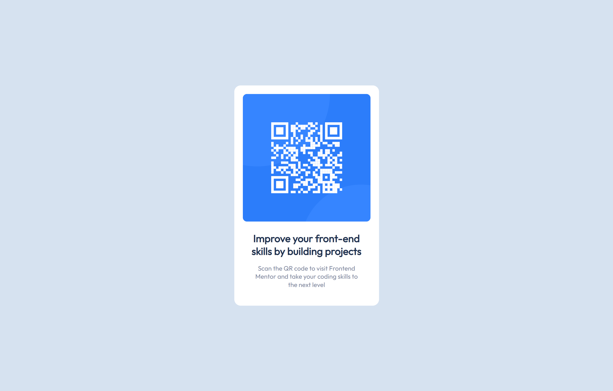

# Frontend Mentor - QR code component solution

This is a solution to the [QR code component challenge on Frontend Mentor](https://www.frontendmentor.io/challenges/qr-code-component-iux_sIO_H). Frontend Mentor challenges help you improve your coding skills by building realistic projects. 

## Table of contents

- [Overview](#overview)
  - [Screenshot](#screenshot)
  - [Links](#links)
  - [Built with](#built-with)
- [Author](#author)

## Overview

### Screenshot

- Desktop View:

- Mobile View:

### Links

- Solution URL: [Add solution URL here](https://github.com/akarsh1028/qr-code-component-main)
- Live Site URL: [Add live site URL here](https://qr-code-component-main-nine-drab.vercel.app/)

## My process

### Built with

- Semantic HTML5 markup
- CSS custom properties
- Flexbox
- Mobile-first workflow

## Author

- My Portfolio - [Akarsh Sharma](https://akarshsharma.vercel.app/)
- Frontend Mentor - [@akarsh1028](https://www.frontendmentor.io/profile/akarsh1028)
- Linkedin - [@akarshsharma001](https://www.linkedin.com/in/akarshsharma001/)
